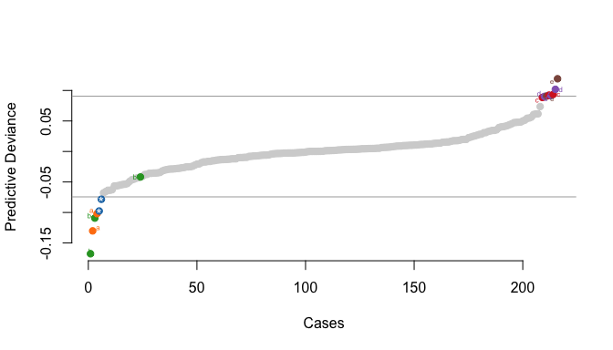

<!-- README.md is generated from README.Rmd. Please edit that file -->

# SEMCOA - Composite Overfit Analysis for Structural Equation Models

`semcoa` is an R package to conduct the Composite Overfit Analysis (COA)
framework for Structural Equation Models (SEM), and to then report and
plot results.

## Installation

``` r
# install.packages("devtools")
devtools::install_github("sem-in-r/semcoa")
```

## Required Libraries

Please install following packages:

-   seminr (composite model estimation)
-   rpart (decision tree)
-   maptools (plotting labels)

## Testing

Run all tests using ‘Test Package’ of RStudio, or run specific test
files using `devtools`:

``` r
test_active_file("tests/testthat/test-integration-coa.R")
test_active_file("tests/testthat/test-unit-dtree.R")
```

## Demo

Look at [demos](demos/) folder for full examples. The following is a
brief look at the code and output.

First, let’s setup our composite construct-based model using the seminr
package for specifying structural equation models.

    #> Generating the seminr model
    #> All 216 observations are valid.

Now, we can conduct our Composite Overfit Analysis (COA). We start by
loading the `semcoa` library:

``` r
library(semcoa)
library(rpart)
library(maptools)
#> Loading required package: sp
#> Checking rgeos availability: FALSE
#>      Note: when rgeos is not available, polygon geometry     computations in maptools depend on gpclib,
#>      which has a restricted licence. It is disabled by default;
#>      to enable gpclib, type gpclibPermit()
```

Now we can analyze our estimated composite SEM model using COA:

``` r
utaut_overfit <- coa(pls_model = utaut_model, 
                     focal_construct = "BI",
                     params = c("path_coef", "rSquared"))
#> Computing predictive deviance
#> Generating Deviance Tree
#> Identifying Unstable Paths
```

We can visualize our predictive deviant cases and groups as follows:

``` r
plot_pd(utaut_overfit)
```



``` r
# Inspect all the names of the groups
names(utaut_overfit$dtree$deviant_groups)
#> [1] "a" "b" "c" "d" "e"
```

And we can inspect more details about the groups by seeing the defining
descriptive characteristics of each group.

``` r
# Get descriptive characteristics of one of the groups
group_rules("b", utaut_overfit$dtree)
#> BI < -0.53
#> -2.45 <= FC < -0.93
#> HAB < 1.00
#> -1.06 <= PE
```

And finally, we can examine unstable paths of any of our groups.

``` r
unstable <- unstable_params(analysis = utaut_overfit)
#> Identifying Unstable Paths

unstable$group_diffs$b
#> $group
#> [1] 12 71 99
#> 
#> $param_diffs
#> $param_diffs$path_coef
#>        PE EE SI FC HM PV HAB Exp Age Gender           BI
#> PE      0  0  0  0  0  0   0   0   0      0 -0.018426546
#> EE      0  0  0  0  0  0   0   0   0      0 -0.005368748
#> SI      0  0  0  0  0  0   0   0   0      0  0.004796548
#> FC      0  0  0  0  0  0   0   0   0      0  0.032766535
#> HM      0  0  0  0  0  0   0   0   0      0 -0.022661261
#> PV      0  0  0  0  0  0   0   0   0      0  0.033025676
#> HAB     0  0  0  0  0  0   0   0   0      0  0.004836042
#> Exp     0  0  0  0  0  0   0   0   0      0 -0.001911413
#> Age     0  0  0  0  0  0   0   0   0      0  0.010783469
#> Gender  0  0  0  0  0  0   0   0   0      0 -0.009425882
#> BI      0  0  0  0  0  0   0   0   0      0  0.000000000
```
